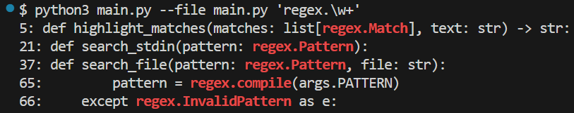

# Regex Search Utility

This is a command-line tool written in Python that mimics the behavior of grep by matching text with regular expressions. It implements its own custom regex engine that supports a subset of perl-style regular expressions and has the ability to search for patterns in files or from standard input.

<div align="center">  
    
</div>

## Supported Tokens

### Dot

- `.`: Matches any character

### Anchors

- `^`: Asserts that the following pattern must match at the start of the input or line
    - Ex: `^World` matches `World` but not `Hello World`
- `$`: Asserts that the preceding pattern must match at the end of the input or line
    - Ex: `World$` matches `Hello World` but not `Worldwide`

### Repetition Operators

- `*` Greedily matches 0 or more occurrences of the previous element
    - Ex: `ca*t` matches `ct` or `caaat` but not `cut`
- `+` Greedily matches 1 or more occurrences of the previous element
    - Ex: `do+g` matches `dog` or `dooog` but not `dg`
- `?` Matches 0 or 1 occurrence of the previous element
    - Ex: `ba?t` matches `bat`or `bt` but not `baat`

### Meta Sequences

- `\d` matches any digit (0-9)
    - Ex: `\d apples` matches `5 apples` but not `five apples`
- `\w` matches any word character (letters, digits, underscores)
    - Ex: `\w\w`matchs `hi` but not `h!`
- `\s` matches any whitespace character (space, tab, newline)


### Character Classes

- `[...]` matches any one of the characters listed
    - Ex: `[bc]at` matches `cat` but not `rat`
- `[^...]` matches any character except the ones listed
    - Ex: `[^bc]at` matches `rat` but not `cat`
- `[^a-f]` matches any character in the range `a` - `f`
    - Ex: `[a-f]at` matches `bat` but not `hat`

### Alternation

- `PTRN1|PTRN`: Matches either `PTRN1` or `PATRN2`
    - Ex: `cat|dog` matches `cat` or `dog` but not `bat`

### Grouping

- `(...)`: Isolates part of the full match to be later referred to by ID within the regex. Can also be used in combination with repetition operators or ranges.
    - Ex: `(ab)+` matches `ab`, `abab`, `ababab` and so on

### Backreference

- `\n` refers to the nth grouped sub pattern, allowing you to reuse the matched text later in the pattern
    - Ex: `(\w+) egg and \1 ham` matches `green eggs and green ham`

### Range Quantifiers

- `{n}` Matches exactly `n` occurrences of the previous element 
    - Ex: `ca{3}t` matches `caaat` but not `caat`
- `{n,m}` Greedily matches between `n` and `m` occurrences of the previous element 
    - Ex: `(ha){2,3}` matches `haha` and `hahaha` but not `ha`
- `{n,}` Greedily matches `n` or more occurrences of the previous element 
    - Ex: `bo{2,}` matches `boooo` but not `bo`

## Regex Grammar

The regex engine supports the following grammar:

```
regex              := sequence ('|' sequence)*
sequence           := repetition+
repetition         := atom ('*' | '+' | '?' | range)?
range              := '{' number (',' number?)? '}'
number             := ('0' | '1' | ... | '9')+

atom               := '.' | '^' | '$' | literal | charclass | group | backreference | metasequence | escape
charclass          := '[' '^'? (literal | literal '-' literal)+ ']'
group              := '(' regex ')'
backreference      := '\' number
metasequence       := '\' ('d' | 'D'| 'w' | 'W' | 's' | 'S')
escape             := '\' ('.' | '^' | '$' | '*' | '+' | '?' | '{' | '}' | '(' | ')' | '[' | ']' | '\' | '|')
```


## Usage

### As Program

The program can be run from the command-line and has the following usage pattern:

```
usage: main.py [-h] [-f FILE] PATTERN

positional arguments:
  PATTERN               regular expression pattern

options:
  -h, --help            show this help message and exit
  -f FILE, --file FILE  file to search for all occurences of pattern. 
                        If no file is provided read from stdin
```
  
#### Examples

1. Searching a file for given pattern:

```bash
python3 main.py -f example.txt "(\d{3}-){2}\d{4}"
```

2. Searching from Standard Input:

```bash
cat example.txt | python3 main.py "(\d{3}-){2}\d{4}"
```


### As Module

You can also import the engine to use in your own python programs. It follows a similar API to Python's standard library module `re`.  To use simply import `regex` and call the `compile(regex)` function which will return a `Pattern` object that can be used to match strings against the regex pattern. `Pattern` supports the following methods:

- `.search(str)`: Will search the entire string and return the first  substring that matches as a `Match` object or `None` if no match was found
- `.match(str)`: Will return a `Match` object if the pattern matches at the **beginning** of the string, else `None`
- `.fullmatch(str)`:  Will return a `Match` object only if the pattern matches the **entire** string, else `None`
- `.findall(str)`: Will search the entire string and return all substrings that match the pattern and return a list of `Match` objects 


#### Example

```python
import regex

pattern = regex.compile(r"(\d{3}-){2}\d{4}")
m = pattern.search("My number is 123-456-7890")
print(m)
# Match(match='123-456-7890', span=(13, 25), captures={1: (17, 21)})
```


## Requirements

- Python `v3.12+`