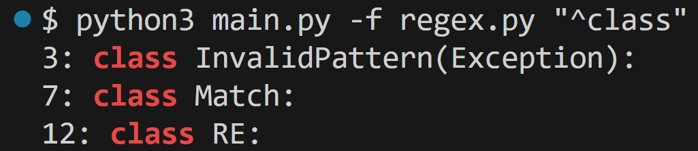

# Regex Search Utility

This is a command-line tool written in Python that mimics the behavior of grep by matching text with regular expressions. It supports a custom subset of regular expression syntaxes and has the ability to search for patterns in files or from standard input.



## Supported Regex

The program supports the following regular expression constructs

### Character

- Matches a literal character 

### Dot

- `.`: Matches any character

### Start Anchor

- `^`: Asserts that the following pattern must match at the start of the input or line
    - Ex: `^World` matches `World` but not `Hello World`

### End Anchor

- `$`:  Asserts that the preceding pattern must match at the end of the input or line
    - Ex: `World$` matches `Hello World` but not `Worldwide`

### Repetition Operators

- `*` Matches 0 or more occurrences of the previous element
    - Ex: `ca*t` matches `ct` or `caaat` but not `cut`
- `+` Matches 1 or more occurrences of the previous element
    - Ex: `do+g` matches `dog` or `dooog` but not `dg`
- `?` Matches 0 or 1 occurrence of the previous element
    - Ex: `ba?t` matches `bat`or `bt` but not `baat`

### Predefined Classes

- `\d` matches any digit (0-9)
    - Ex: `\d apples` matches `5 apples` but not `five apples`
- `\w` matches any word character (letters, digits, underscores)
    - Ex: `\w\w`matchs `hi` but not `h!`

### Character Classes

- `[...]` matches any one of the characters listed
    - Ex: `[bc]at` matches `cat` but not `rat`
- `[^...]` matches any character except the ones listed
    - Ex: `[^bc]at` matches `rat` but not `cat`


### Grouping and Alternation

- `(...)`: Creates a group that can be referenced later and allows for alternation
    - Ex: `(cat|dog)` matches `cat` or `dog` but not `bat`

### Backreference

- `\n` refers to the nth grouped sub pattern, allowing you to reuse the matched text later in the pattern
    - Ex: `(\d+) (\w+) squares and \1 \2 circles` matches `3 red squares and 3 red circles` but not `3 red squares and 3 blue circles`

  

## Usage

The program can be run from the command-line with the following usage pattern:

  
```bash
usage: main.py [-h] [-f FILE] PATTERN

positional arguments:
  PATTERN               regular expression pattern

options:
  -h, --help            show this help message and exit
  -f FILE, --file FILE  file to search for all occurences of pattern. If no file is provided read from stdin
```
  

### Examples

1. Searching from a file:

```bash
python main.py -f example.txt "^(abc|def)\d+$"
```

2. Searching from Standard Input:

```bash
cat example.txt | python main.py "\w+"
```